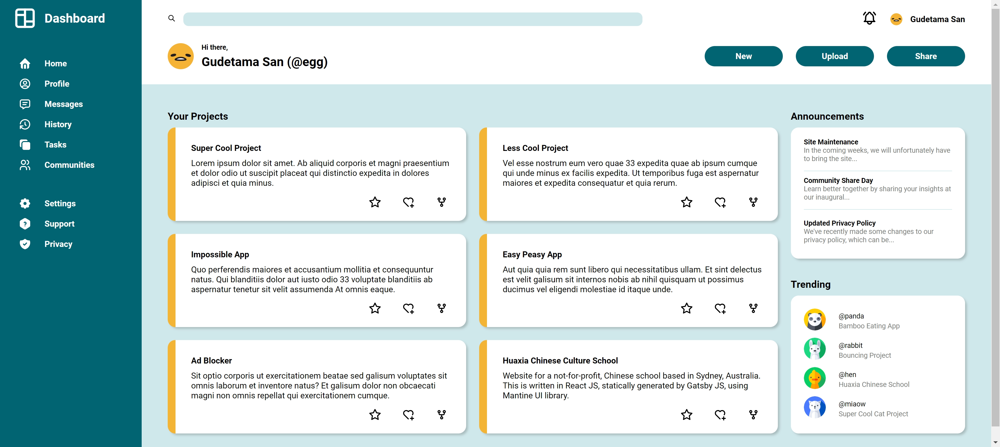

# Admin Dashboard

Dummy dashboard to mimic the user interface (UI) of various administrative-level functionalities after user logs into a web application. Written in HTML and CSS only.

Capstone project for The Odin Project's "Intermediate HTML and CSS" unit.

## Credits

- [Tabler Icons](https://tabler.io/icons)
- <a href="https://www.flaticon.com/free-icons/avatar" title="avatar icons">Freepik - Flaticon</a>

## License

[MIT](https://choosealicense.com/licenses/mit/) © [henrylin03](https://github.com/henrylin03/)
